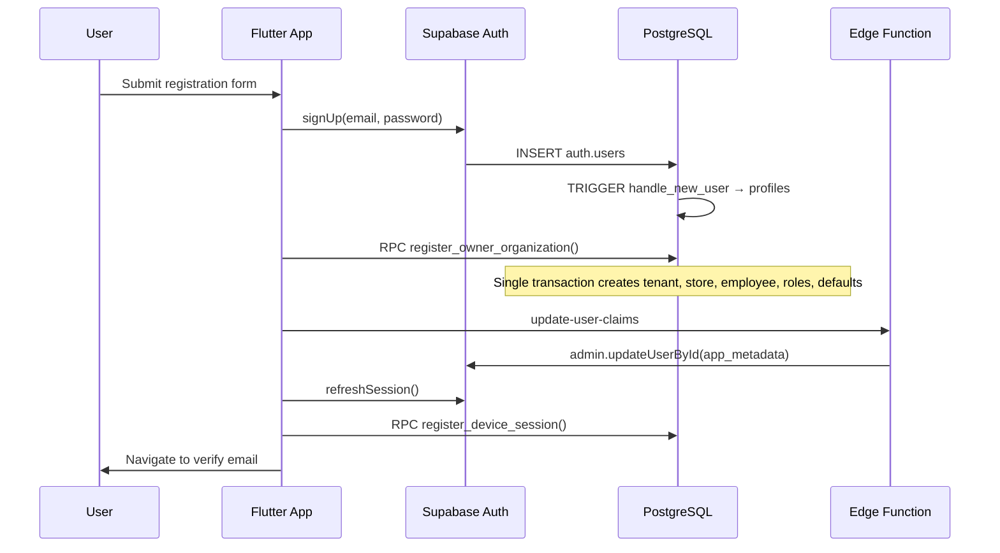
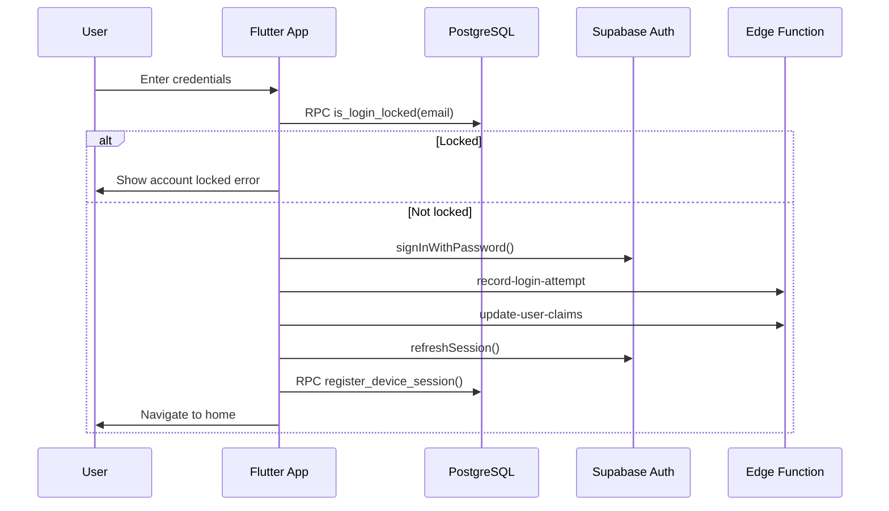
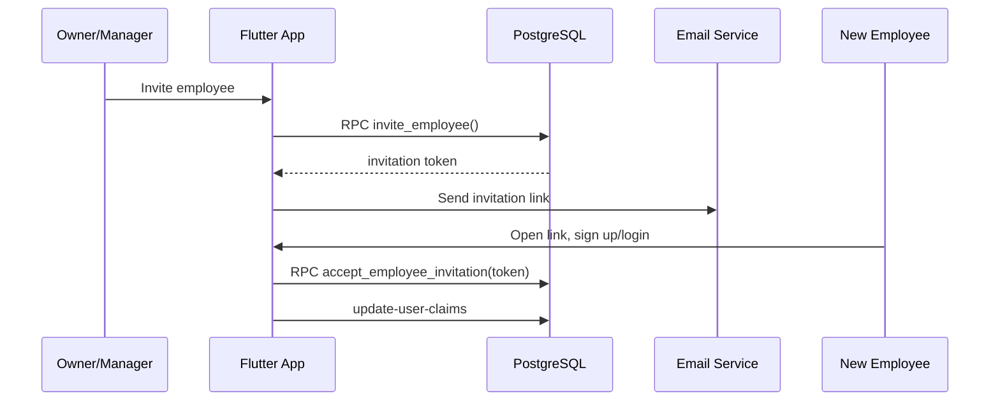

# Authentication Sequence Diagrams

## Owner Registration

```mermaid
sequenceDiagram
  participant U as User
  participant App as Flutter App
  participant Auth as Supabase Auth
  participant DB as PostgreSQL
  participant EF as Edge Function

  U->>App: Submit registration form
  App->>Auth: signUp(email, password)
  Auth->>DB: INSERT auth.users
  DB->>DB: TRIGGER handle_new_user → profiles
  App->>DB: RPC register_owner_organization()
  Note over DB: Single transaction creates tenant, store, employee, roles, defaults
  App->>EF: update-user-claims
  EF->>Auth: admin.updateUserById(app_metadata)
  App->>Auth: refreshSession()
  App->>DB: RPC register_device_session()
  App->>U: Navigate to verify email
```

## Login

```mermaid
sequenceDiagram
  participant U as User
  participant App as Flutter App
  participant DB as PostgreSQL
  participant Auth as Supabase Auth
  participant EF as Edge Function

  U->>App: Enter credentials
  App->>DB: RPC is_login_locked(email)
  alt Locked
    App->>U: Show account locked error
  else Not locked
    App->>Auth: signInWithPassword()
    App->>EF: record-login-attempt
    App->>EF: update-user-claims
    App->>Auth: refreshSession()
    App->>DB: RPC register_device_session()
    App->>U: Navigate to home
  end
```

## Employee Invitation

```mermaid
sequenceDiagram
  participant Admin as Owner/Manager
  participant App as Flutter App
  participant DB as PostgreSQL
  participant Email as Email Service
  participant Emp as New Employee

  Admin->>App: Invite employee
  App->>DB: RPC invite_employee()
  DB-->>App: invitation token
  App->>Email: Send invitation link
  Emp->>App: Open link, sign up/login
  App->>DB: RPC accept_employee_invitation(token)
  App->>DB: update-user-claims
```
