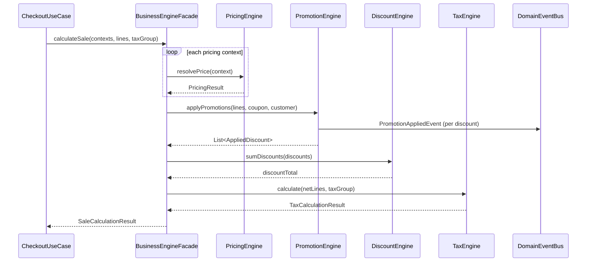
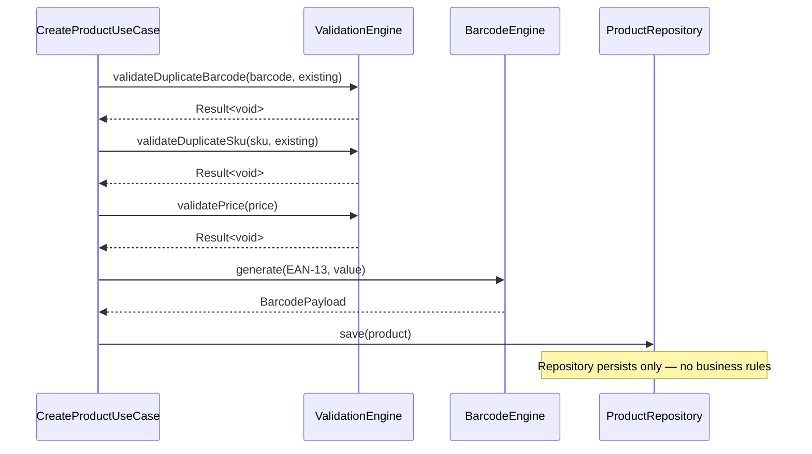
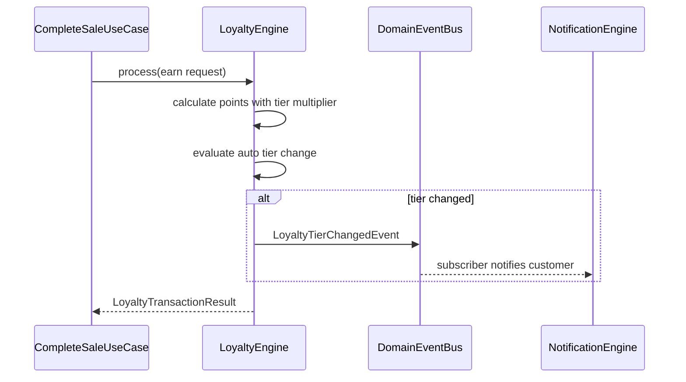
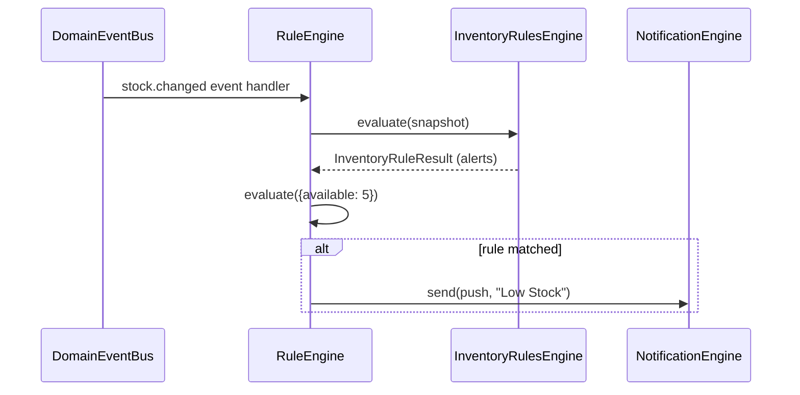
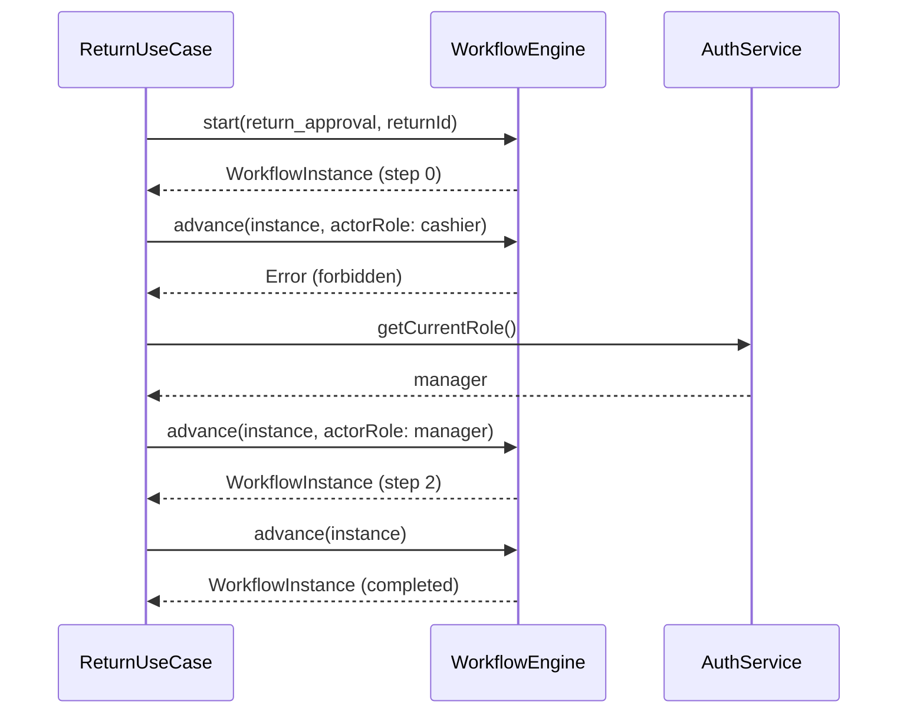
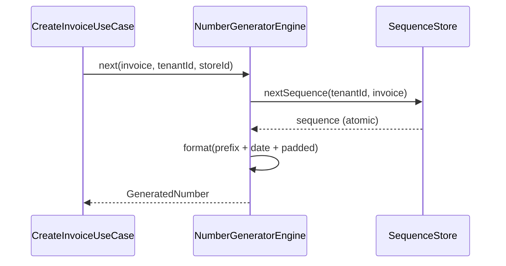

# Business Engine — Sequence Diagrams

## Sale Calculation (BusinessEngineFacade)

## Product Creation Validation

## Loyalty Earn + Tier Upgrade

## Inventory Reorder Rule

## Workflow Approval (Return)

## Number Generation

