# Entity-Relationship Diagram

High-level ERD for FashionOS. All tenant-bound entities include `tenant_id` → `tenants`. Diagrams are grouped by domain; see [RELATIONSHIPS.md](./RELATIONSHIPS.md) for the full FK list.

```mermaid
erDiagram
  %% ========== Tenant & Organization ==========
  tenants ||--o{ tenant_subscriptions : has
  subscription_plans ||--o{ tenant_subscriptions : offers
  tenants ||--o{ stores : operates
  tenants ||--o{ warehouses : owns
  stores ||--o{ warehouses : may_have
  tenants ||--o{ numbering_sequences : sequences
  stores ||--o{ numbering_sequences : scoped
  tenants ||--o{ settings : configures
  stores ||--o{ settings : overrides

  %% ========== Identity & Access ==========
  tenants ||--o{ roles : defines
  permissions ||--o{ role_permissions : granted_in
  roles ||--o{ role_permissions : includes
  tenants ||--o{ employees : employs
  profiles ||--|| employees : links
  employees ||--o{ employee_store_assignments : assigned
  stores ||--o{ employee_store_assignments : access
  employees ||--o{ employee_roles : has
  roles ||--o{ employee_roles : via

  %% ========== Catalog ==========
  tenants ||--o{ brands : owns
  tenants ||--o{ categories : owns
  categories ||--o{ categories : parent
  tenants ||--o{ products : sells
  brands ||--o{ products : brand
  categories ||--o{ products : category
  products ||--o{ product_variants : variants
  colors ||--o{ product_variants : color
  sizes ||--o{ product_variants : size
  product_variants ||--o{ product_variant_barcodes : barcodes
  products ||--o{ product_images : images
  tenants ||--o{ taxes : defines
  products ||--o{ product_taxes : taxed_by
  taxes ||--o{ product_taxes : applied

  %% ========== Inventory ==========
  product_variants ||--o{ inventory_items : stocked
  warehouses ||--o{ inventory_items : holds
  inventory_items ||--o{ inventory_movements : ledger
  stores ||--o{ stock_adjustments : at
  stock_adjustments ||--o{ stock_adjustment_lines : lines
  product_variants ||--o{ stock_adjustment_lines : sku
  inventory_transfers ||--o{ inventory_transfer_lines : lines
  warehouses ||--o{ inventory_transfers : from_to

  %% ========== Purchases ==========
  tenants ||--o{ suppliers : vendors
  suppliers ||--o{ purchase_orders : po
  stores ||--o{ purchase_orders : destination
  purchase_orders ||--o{ purchase_order_lines : lines
  product_variants ||--o{ purchase_order_lines : sku
  purchase_orders ||--o{ purchase_receipts : received
  purchase_receipts ||--o{ purchase_receipt_lines : lines

  %% ========== Customers & Loyalty ==========
  tenants ||--o{ customers : crm
  customers ||--o{ customer_addresses : addresses
  loyalty_programs ||--o{ loyalty_tiers : tiers
  customers ||--o{ customer_loyalty_accounts : enrolled
  loyalty_programs ||--o{ customer_loyalty_accounts : program
  customer_loyalty_accounts ||--o{ loyalty_point_transactions : points

  %% ========== Sales & POS ==========
  stores ||--o{ pos_registers : registers
  pos_registers ||--o{ cash_sessions : sessions
  cash_sessions ||--o{ cash_session_movements : movements
  stores ||--o{ sale_orders : sales
  sale_orders ||--o{ sale_order_lines : lines
  product_variants ||--o{ sale_order_lines : sold
  sale_order_lines ||--o{ sale_order_line_taxes : tax
  sale_orders ||--o{ sale_payments : paid
  payment_methods ||--o{ sale_payments : method
  coupons ||--o{ coupon_redemptions : redeemed
  sale_orders ||--o{ coupon_redemptions : on_sale
  customers ||--o{ sale_orders : buyer

  %% ========== Returns & Exchanges ==========
  sale_orders ||--o{ sale_returns : returned
  sale_returns ||--o{ sale_return_lines : lines
  sale_returns ||--o{ sale_return_payments : refund
  sale_returns ||--o{ exchanges : exchange
  sale_orders ||--o{ exchanges : replacement
  exchanges ||--o{ exchange_lines : lines

  %% ========== Financial ==========
  stores ||--o{ expenses : spend
  expense_categories ||--o{ expenses : category
  stores ||--o{ daily_closings : eod
  daily_closings ||--o{ daily_closing_payments : totals
  payment_methods ||--o{ daily_closing_payments : by_method

  %% ========== System & Sync ==========
  tenants ||--o{ devices : registers_device
  stores ||--o{ receipt_templates : template
  employees ||--o{ notifications : notify
  tenants ||--o{ audit_logs : audit
  tenants ||--o{ file_attachments : files
  devices ||--o{ sync_devices : paired
  sync_devices ||--o{ sync_queue : queue
  sync_queue ||--o{ sync_conflicts : conflicts
  devices ||--o{ sync_checkpoints : checkpoint

  tenants {
    uuid id PK
    text slug
    tenant_status status
  }
  stores {
    uuid id PK
    uuid tenant_id FK
    text code
  }
  products {
    uuid id PK
    uuid tenant_id FK
    text name
  }
  product_variants {
    uuid id PK
    uuid product_id FK
    numeric price
  }
  sale_orders {
    uuid id PK
    uuid tenant_id FK
    uuid store_id FK
    sale_status status
  }
  inventory_items {
    uuid id PK
    uuid warehouse_id FK
    uuid variant_id FK
    numeric quantity_on_hand
  }
```

## Reading the diagram

- **Cardinality** reflects logical business relationships; physical FKs may also include optional nullable links (e.g. `products.brand_id`).
- **Platform tables** `subscription_plans` and `permissions` sit outside tenant RLS scope but connect to tenant data through subscriptions and role grants.
- **Auth** — `profiles.id` equals `auth.users.id` (Supabase Auth); not shown as a DB FK in ERD.

## Conventions

- PK columns are `id UUID` unless noted in [TABLES.md](./TABLES.md).
- Line tables (`*_lines`) always reference a header (`*_id`) and a `product_variant_id` where applicable.
