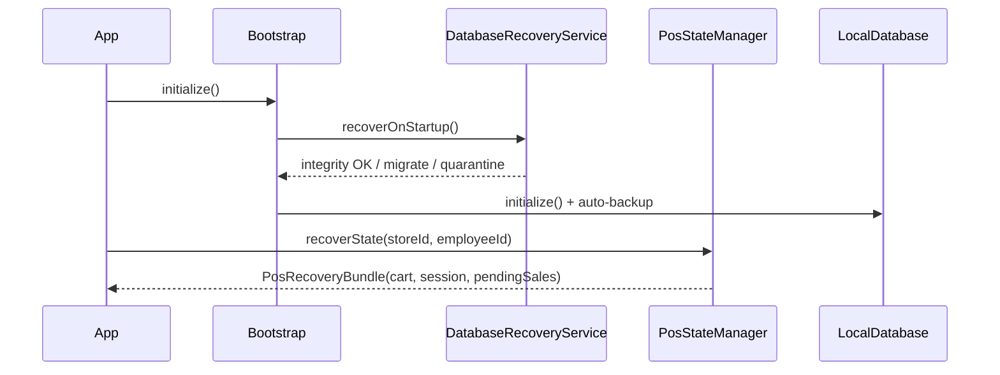

# Enterprise Platform Architecture

Fashion POS Enterprise is built as a commercial, offline-first, multi-tenant POS platform. This document describes the production platform layer added on top of the Phase 0 foundation and Phase 3 authentication.

## Design Principles

| Principle | Implementation |
|-----------|----------------|
| Offline-first | Encrypted local SQLite is the primary data store on device |
| Never lose a sale | Crash-safe transactions, cart auto-save, recovery on startup |
| Scalability | FTS search, pagination, server indexes for 100k+ products / 1M+ invoices |
| Modularity | Independent modules + isolated plugin registry |
| White-label | Runtime branding from local config — no source changes |
| Internet optional | Sync, backup, license check, remote config only when online |

## Platform Layers

```
┌─────────────────────────────────────────────────────────────┐
│  Features (auth, pos, products, …) — independent modules  │
├─────────────────────────────────────────────────────────────┤
│  Design System (Material 3, RTL/LTR, dark/light, a11y)      │
├─────────────────────────────────────────────────────────────┤
│  Enterprise Services                                        │
│  • License (offline grace)  • White-label  • Monitoring   │
│  • Import/Export            • Hardware adapters             │
├─────────────────────────────────────────────────────────────┤
│  POS Reliability                                            │
│  • PosStateManager (cart/session auto-save)                 │
│  • ProductSearchService (FTS <100ms target)                │
│  • AuditService (local + sync)                              │
├─────────────────────────────────────────────────────────────┤
│  Local Data Plane                                           │
│  • SQLCipher encrypted DB v2                                │
│  • CrashSafeTransaction (WAL + FULL sync)                   │
│  • DatabaseBackupService (auto ZIP every 6h)                │
│  • DatabaseRecoveryService (integrity + migration)        │
├─────────────────────────────────────────────────────────────┤
│  Sync Engine → Supabase (when online)                       │
└─────────────────────────────────────────────────────────────┘
```

## Local Database (v2)

**Path:** `lib/core/local_database/`

| Table | Purpose |
|-------|---------|
| `pos_carts_local` | Active cart auto-save per cashier |
| `pos_cash_sessions_local` | Open cash drawer session recovery |
| `audit_log_local` | Append-only audit trail (synced flag) |
| `license_cache_local` | Offline license with grace period |
| `app_recovery_state` | Startup checkpoints |
| `products_fts` | FTS5 index for sub-100ms search |

Encryption key is generated once and stored in `flutter_secure_storage`.

## POS Crash Recovery Flow



## Module System

**Path:** `lib/core/modules/module_registry.dart`

Core modules are registered declaratively. Custom vertical modules implement `FashionModule` and register via `ModuleRegistry.register()`.

Dependencies are validated at registration time — a module cannot depend on an unknown module.

## Plugin System

**Path:** `lib/core/plugins/plugin_registry.dart`

Plugins are isolated extensions for future verticals (pharmacy, supermarket, restaurant, etc.):

- Permission sandbox (`products.read`, `sales.write`, …)
- In-process `PluginEventBus` (no direct cross-plugin calls)
- Lifecycle: `initialize(context)` → `dispose()`

Plugin slots: `PluginSlots.pharmacy`, `.supermarket`, `.restaurant`, etc.

## Hardware Adapters

**Paths:** `lib/core/hardware/`

| Adapter | Channels |
|---------|----------|
| `ThermalPrinterAdapter` | Bluetooth, USB, WiFi |
| `BarcodeScannerAdapter` | Camera, USB HID, Bluetooth, manual |

`PrinterService` and `BarcodeScannerService` coordinate adapters. Platform-specific implementations are added per deployment target without changing POS UI.

## License (Offline Grace)

**Path:** `lib/core/enterprise/license_service.dart`

1. When online → validate via `LicenseValidator` + cache locally
2. When offline → evaluate cached license
3. Expired subscription → grace period (default 7 days)
4. POS **never stops immediately** when internet is unavailable

## White-Label

**Path:** `lib/core/white_label/white_label_service.dart`

Configurable at runtime per tenant:

- App name, logo, splash, primary/secondary colors
- Receipt header/footer
- Stored in `settings_local` — no rebuild required

## Monitoring Extension Points

**Path:** `lib/core/monitoring/monitoring_hub.dart`

| Concern | Hook |
|---------|------|
| Crash reporting | `CrashReportingService.captureException` |
| Analytics | `AnalyticsService.track` |
| Performance | `PerformanceMonitor` with budgets |
| Remote logs | Via sync queue + server ingestion (future) |

Wire Sentry, Firebase, or Datadog in production by replacing static hooks in `analytics_service.dart` and `crash_reporting_service.dart`.

## Performance Budgets

| Operation | Target |
|-----------|--------|
| App startup | < 2s |
| Product search | < 100ms |
| Barcode lookup | < 100ms |
| Checkout | < 1s |

## Future AI Extension Points

Architecture prepares for (not yet implemented):

- Sales/inventory forecast → `reports` + time-series data pipeline
- Smart search → extend `ProductSearchService` with embedding index
- Business assistant → `features/ai` module slot in `ModuleRegistry`
- Voice commands → `BarcodeScannerService` + speech adapter plugin

## Accounting & E-Commerce Ready

- Double-entry: `sale_orders`, `sale_payments`, `inventory_movements` form journal-ready facts
- E-commerce sync: `sync_queue` entity types + `PluginSlots.ecommerce`
- Public API: Supabase RLS + future REST gateway on same schema

## Related Documentation

- [Offline Architecture](../OFFLINE_ARCHITECTURE.md)
- [Testing Strategy](./TESTING_STRATEGY.md)
- [Module System](./MODULE_SYSTEM.md)
- [Auth Extension Points](../auth/EXTENSION_POINTS.md)
