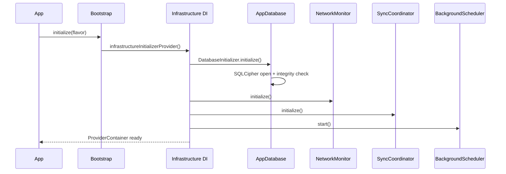
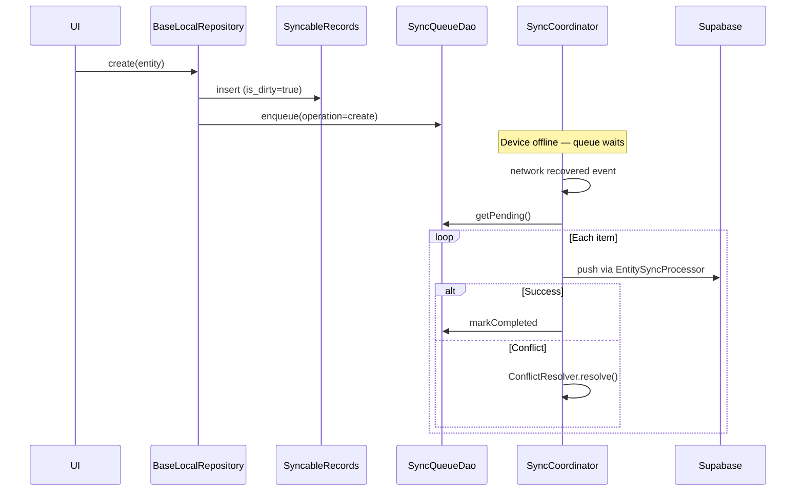
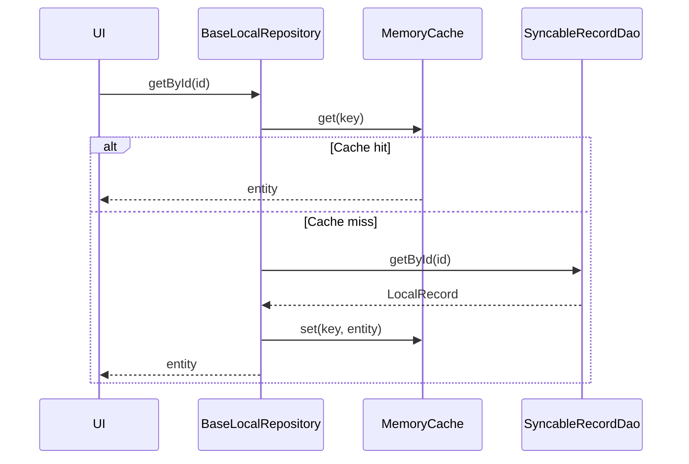

# Infrastructure Sequence Diagrams

## Bootstrap Initialization

```mermaid
sequenceDiagram
    participant App
    participant Bootstrap
    participant DI as Infrastructure DI
    participant DB as AppDatabase
    participant Net as NetworkMonitor
    participant Sync as SyncCoordinator
    participant BG as BackgroundScheduler

    App->>Bootstrap: initialize(flavor)
    Bootstrap->>DI: infrastructureInitializerProvider()
    DI->>DB: DatabaseInitializer.initialize()
    DB->>DB: SQLCipher open + integrity check
    DI->>Net: initialize()
    DI->>Sync: initialize()
    DI->>BG: start()
    DI-->>App: ProviderContainer ready
```

## Offline Write → Online Sync

```mermaid
sequenceDiagram
    participant UI
    participant Repo as BaseLocalRepository
    participant DB as SyncableRecords
    participant Queue as SyncQueueDao
    participant Sync as SyncCoordinator
    participant Server as Supabase

    UI->>Repo: create(entity)
    Repo->>DB: insert (is_dirty=true)
    Repo->>Queue: enqueue(operation=create)
    Note over Sync: Device offline — queue waits

    Sync->>Sync: network recovered event
    Sync->>Queue: getPending()
    loop Each item
        Sync->>Server: push via EntitySyncProcessor
        alt Success
            Sync->>Queue: markCompleted
        else Conflict
            Sync->>Sync: ConflictResolver.resolve()
        end
    end
```

## Repository Read with Cache

```mermaid
sequenceDiagram
    participant UI
    participant Repo as BaseLocalRepository
    participant Cache as MemoryCache
    participant DB as SyncableRecordDao

    UI->>Repo: getById(id)
    Repo->>Cache: get(key)
    alt Cache hit
        Cache-->>UI: entity
    else Cache miss
        Repo->>DB: getById(id)
        DB-->>Repo: LocalRecord
        Repo->>Cache: set(key, entity)
        Repo-->>UI: entity
    end
```
