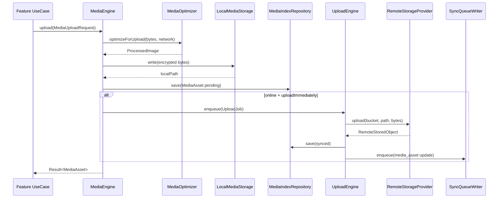
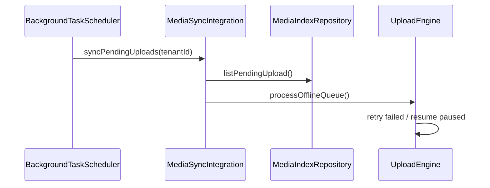
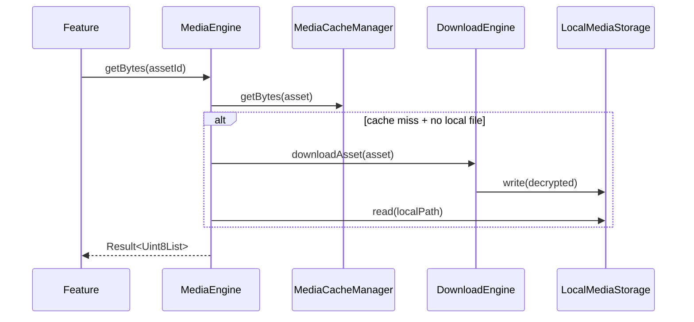
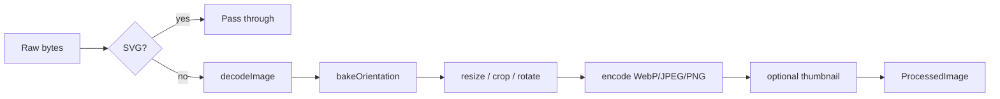

# Media Engine — Sequence Diagrams

## Upload Flow

```mermaid
sequenceDiagram
    participant F as Feature UseCase
    participant M as MediaEngine
    participant O as MediaOptimizer
    participant L as LocalMediaStorage
    participant I as MediaIndexRepository
    participant U as UploadEngine
    participant R as RemoteStorageProvider
    participant S as SyncQueueWriter

    F->>M: upload(MediaUploadRequest)
    M->>O: optimizeForUpload(bytes, network)
    O-->>M: ProcessedImage
    M->>L: write(encrypted bytes)
    L-->>M: localPath
    M->>I: save(MediaAsset pending)
    alt online + uploadImmediately
        M->>U: enqueue(UploadJob)
        U->>R: upload(bucket, path, bytes)
        R-->>U: RemoteStoredObject
        U->>I: save(synced)
        U->>S: enqueue(media_asset update)
    end
    M-->>F: Result<MediaAsset>
```

## Offline → Online Sync

```mermaid
sequenceDiagram
    participant B as BackgroundTaskScheduler
    participant MS as MediaSyncIntegration
    participant I as MediaIndexRepository
    participant U as UploadEngine

    B->>MS: syncPendingUploads(tenantId)
    MS->>I: listPendingUpload()
    MS->>U: processOfflineQueue()
    U->>U: retry failed / resume paused
```

## Download for Offline Display

```mermaid
sequenceDiagram
    participant UI as Feature
    participant M as MediaEngine
    participant C as MediaCacheManager
    participant D as DownloadEngine
    participant L as LocalMediaStorage

    UI->>M: getBytes(assetId)
    M->>C: getBytes(asset)
    alt cache miss + no local file
        M->>D: downloadAsset(asset)
        D->>L: write(decrypted)
        M->>L: read(localPath)
    end
    M-->>UI: Result<Uint8List>
```

## Image Processing Pipeline

```mermaid
flowchart LR
    A[Raw bytes] --> B{SVG?}
    B -->|yes| C[Pass through]
    B -->|no| D[decodeImage]
    D --> E[bakeOrientation]
    E --> F[resize / crop / rotate]
    F --> G[encode WebP/JPEG/PNG]
    G --> H[optional thumbnail]
    H --> I[ProcessedImage]
```
