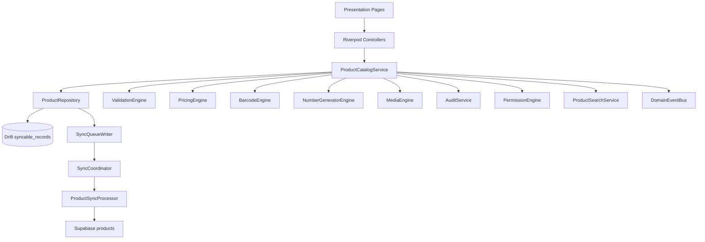
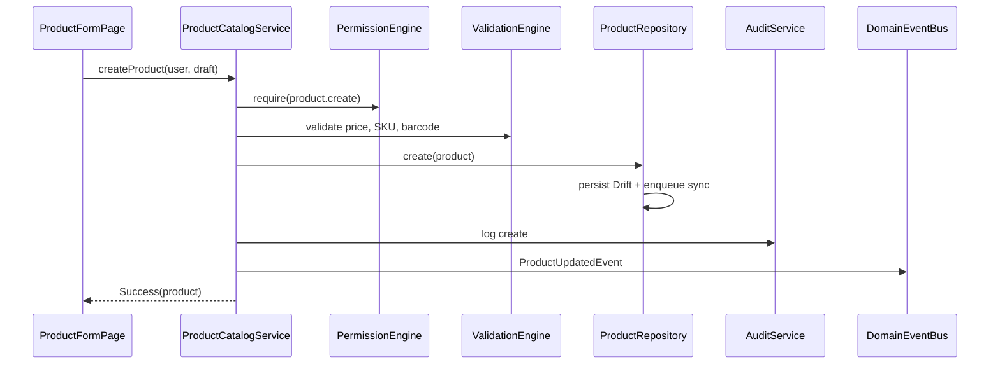
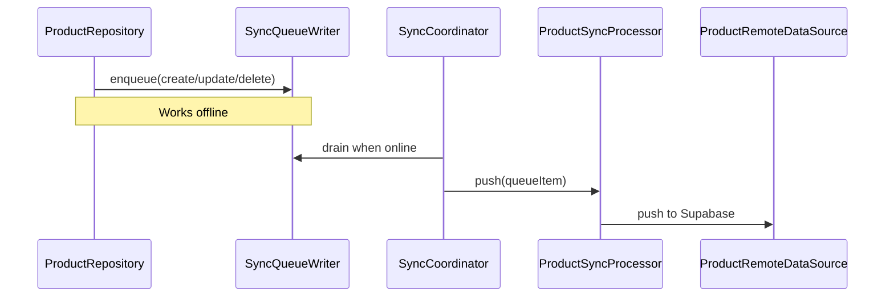

# Product Catalog Architecture

## Clean architecture map

## Sequence: Create product

## Sequence: Offline sync

## Design system integration

Phase 4 extends `lib/design_system/` with catalog-specific components (semantic buttons, product cards, search/filter inputs, dialogs, sheets, data table, state widgets). UI pages consume these exports via `design_system.dart` — no duplicate button or card implementations in the feature module.

## Permissions

| Code | Usage |
|------|-------|
| `product.read` | List and detail screens |
| `product.create` | New product form |
| `product.update` | Edit, restore, media |
| `product.delete` | Soft delete |
| `product.import` / `product.export` | Import page |
| `product.bulk` | Bulk archive |
| `category.*` / `brand.*` | Taxonomy screens |

## Audit events

`ProductCatalogService` logs create, update, delete, restore, import, export, and metadata for price/barcode/media changes through `AuditService`.
