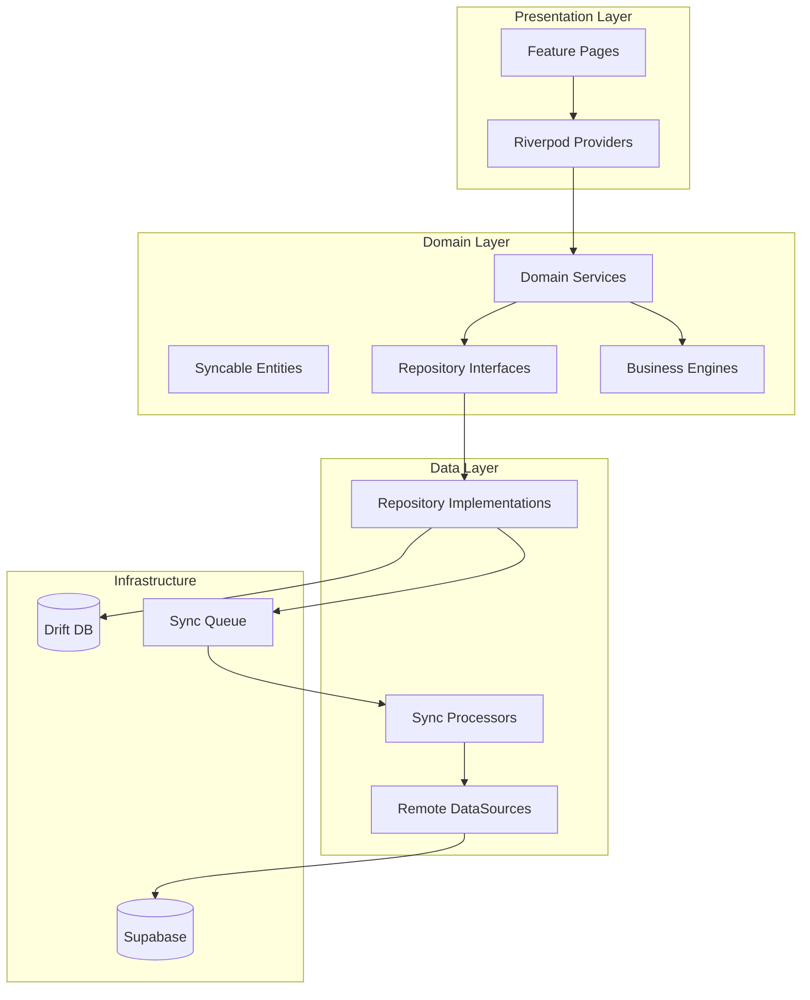

# Architecture Audit Report — RC2

**Date:** 2026-07-14  
**Scope:** Full codebase post Phase 18 hardening

## Layer Diagram



## Module Registration Audit

| Module | Bootstrap | auth_router | Foundation Page |
|--------|-----------|-------------|-----------------|
| Products | ✅ | ✅ | ✅ |
| Inventory | ✅ | ✅ | ✅ |
| Purchasing | ✅ | ✅ | ✅ |
| Customers | ✅ | ✅ | ✅ |
| POS | ✅ | ✅ | ✅ |
| Accounting | ✅ | ✅ | ✅ |
| HR | ✅ | ✅ | ✅ |
| Manufacturing | ✅ | ✅ | ✅ |
| Analytics | ✅ | ✅ | ✅ |
| Sales OMS | ✅ | ✅ | ✅ |
| Treasury | ✅ | ✅ | ✅ |
| Integrations | ✅ | ✅ | ✅ |
| Automation | ✅ | ✅ | ✅ |
| System | ✅ | ✅ | ✅ |
| Workflow | ✅ | ✅ | ✅ |
| Assets | ✅ | ✅ | ✅ |

**Result:** All 16 modules registered consistently across bootstrap, router, and foundation navigation.

## Cross-Cutting Concerns

| Concern | Implementation | RC2 Status |
|---------|----------------|------------|
| DI | Riverpod + `bootstrap.dart` initializers | ✅ |
| Events | `DomainEventBus` | ✅ |
| Numbers | `NumberGeneratorEngine` | ✅ |
| Permissions | `permission_codes.dart` (namespaced) | ✅ Fixed collisions |
| Audit | `AuditService` | ✅ |
| Offline | Drift + `SyncQueueWriter` | ✅ |
| Encryption | SQLCipher-compatible Drift | ✅ |

## Folder Structure Compliance

All modules under `lib/features/{module}/` follow:
```
domain/entities|enums|repositories|services|value_objects
data/datasources|repositories|sync
presentation/pages|providers
routing/
di/
```

## Phase 18 Findings

| Finding | Severity | Resolution |
|---------|----------|------------|
| Shared `maintenance.manage` across 3 modules | High | Namespaced to `manufacturing.*`, `system.*`, `assets.*` |
| Treasury reused `BankPermissions` / `ReceiptPermissions` | Medium | Added `TreasuryBankPermissions`, `TreasuryReceiptPermissions` |
| No circular domain imports | — | Confirmed clean |

## Recommendations

1. Add route-level permission guards (currently service-layer + page-level)
2. Consider shared `ModuleRegistry` test to auto-verify bootstrap/router parity
3. Document permission seed migration for existing tenants
