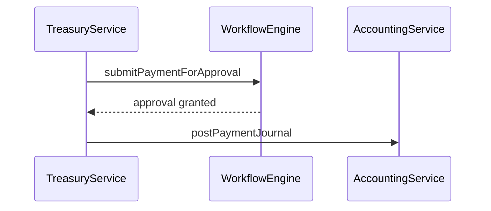
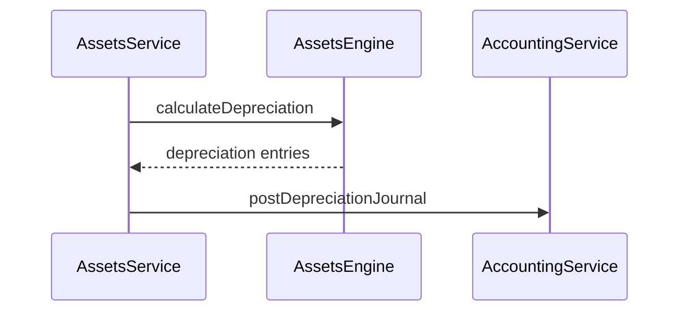

# Integration Report — RC2

**Date:** 2026-07-14

## Internal Cross-Module Integrations

| Source | Target | Mechanism |
|--------|--------|-----------|
| Treasury | Accounting | `TreasuryIntegrationService` — journal entries for payments/receipts |
| Treasury | Workflow | Payment voucher approval workflows |
| Assets | Accounting | Depreciation journal posting via `AssetIntegrationService` |
| Assets | Treasury | Disposal proceeds recording |
| Workflow | Automation | `ApprovalEngine` reuses automation approval templates |
| Workflow | NotificationEngine | Approval/escalation notifications |
| Automation | RuleEngine / WorkflowEngine | Core execution |
| Integrations | ImportExportService | CSV/Excel hub |
| Sales OMS | InventoryEngine | Stock reservation |
| Manufacturing | Inventory | Material consumption |
| HR | Accounting | Payroll journals |
| POS | Accounting | Sale journals |
| System | AuditService | Audit explorer |

## External Integration Points

| Channel | Interface | RC2 Status |
|---------|-----------|------------|
| AI/LLM | AIProvider | NoOp |
| Email/SMS/Push | Channel providers | NoOp |
| OAuth | OAuthProvider | Stub |
| Webhooks | WebhookService | Outbound stub |
| Thermal Printer | PrinterService | Profile storage |

## Treasury Integration Flow

## Assets Integration Flow

## Extension Path

- `docs/treasury/extension-guide.md`
- `docs/assets/architecture.md`
- `docs/workflow/architecture.md`
- `docs/integrations/extension-guide.md`
