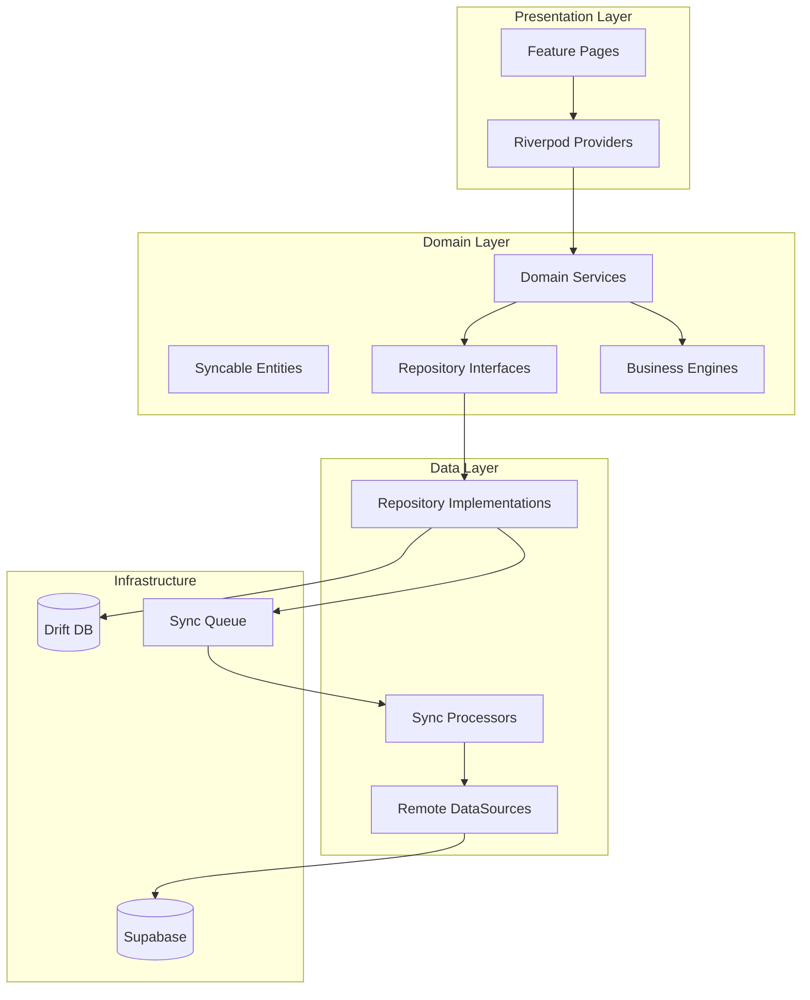

# Architecture Report — RC1

## Layer Diagram



## Cross-Cutting Concerns

| Concern | Implementation |
|---------|----------------|
| DI | Riverpod providers per module + `bootstrap.dart` initializers |
| Events | `DomainEventBus` for cross-module business events |
| Numbers | `NumberGeneratorEngine` with tenant-scoped sequences |
| Permissions | `PermissionEngine` + `permission_codes.dart` |
| Audit | `AuditService` on all mutating service methods |
| Offline | Drift `syncable_records` + `SyncQueueWriter` |
| Encryption | SQLCipher-compatible Drift database |

## Module Dependency Graph (simplified)

- **Automation** → RuleEngine, WorkflowEngine, NotificationEngine
- **Integrations** → ImportExportService, NotificationEngine
- **System** → AuditService, SyncCoordinator
- **Sales OMS** → InventoryEngine, ManufacturingEngine, CRM
- **Analytics** → cross-module report services (read-only)

## Folder Structure Standard

```
lib/features/{module}/
  domain/entities|enums|repositories|services|value_objects
  data/datasources|repositories|sync
  presentation/pages|providers|widgets
  routing/
  di/
```

All 16 modules conform to this structure.
